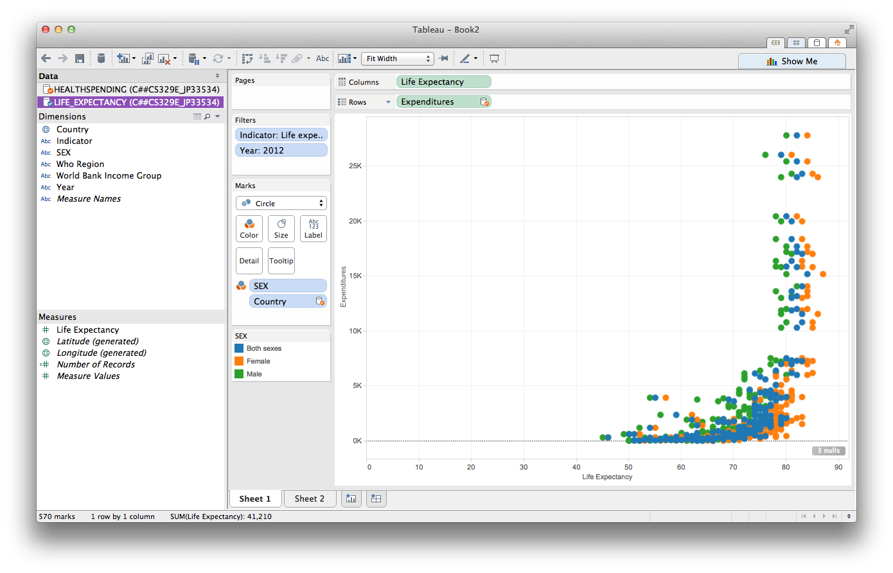
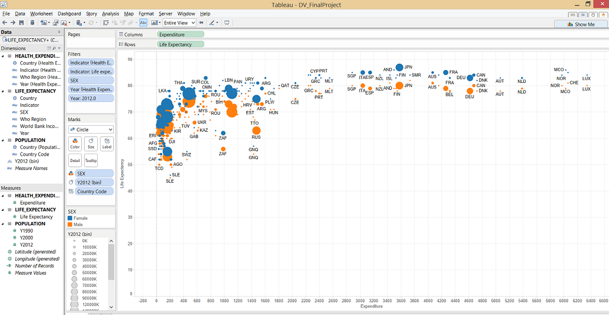
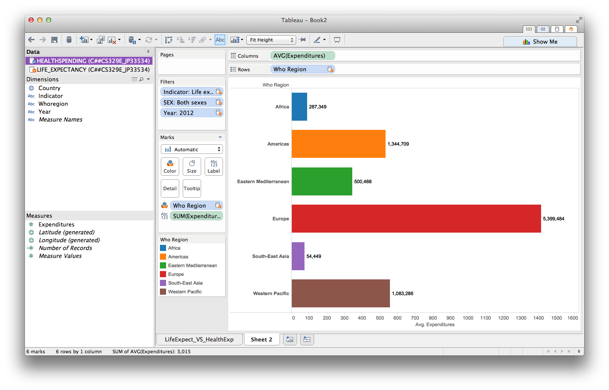
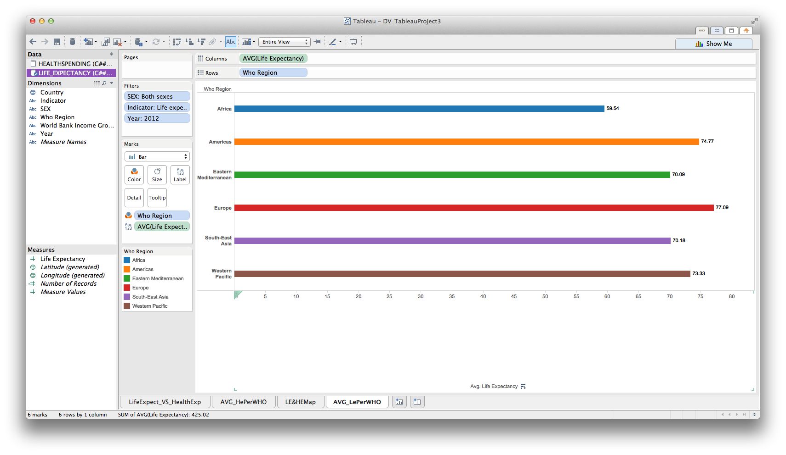
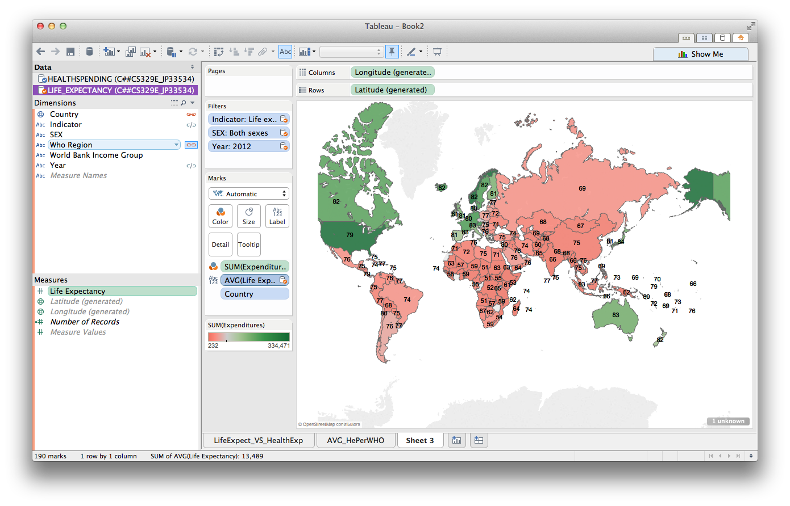

We used public data on the health expenditures based on Purchasing Power Parity (PPP) of each country and the life expectancies at birth of citizens of each country to compare the relationship between a country's comparitive expenses on health and their corresponding life expectancies using visualization tools developed throughout the semester. The population of each country was taken into consideration as a comparison.

* The data sets can be found on the World Health Organization website and on the World Bank website.
    + Health Expenditures: http://apps.who.int/gho/data/view.main.1920ALL?lang=en
    + Life Expectancy: http://apps.who.int/gho/data/view.main.680
    + Population: http://data.worldbank.org/indicator/SP.POP.TOTL

We ran the following queries to extract the data from an Oracle database and store it into a dataframe in R. Our data did not require us to remove special characters such as _%_ and _$_ so it was not necessary to reformat the data.

**life <- data.frame(fromJSON(getURL(URLencode('129.152.144.84:5001/rest/native/?query="select * from LIFE_EXPECTANCY"'),httpheader=c(DB='jdbc:oracle:thin:@129.152.144.84:1521:ORCL', USER='C##cs329e_agc846', PASS='orcl_agc846', MODE='native_mode', MODEL='model', returnDimensions = 'False', returnFor = 'JSON'), verbose = TRUE)))**

**health <- data.frame(fromJSON(getURL(URLencode('129.152.144.84:5001/rest/native/?query="select * from HEALTH_EXPENDITURE"'),httpheader=c(DB='jdbc:oracle:thin:@129.152.144.84:1521:ORCL', USER='C##cs329e_agc846', PASS='orcl_agc846', MODE='native_mode', MODEL='model', returnDimensions = 'False', returnFor = 'JSON'), verbose = TRUE)))**

**population <- data.frame(fromJSON(getURL(URLencode('129.152.144.84:5001/rest/native/?query="select * from POPULATION"'),httpheader=c(DB='jdbc:oracle:thin:@129.152.144.84:1521:ORCL', USER='C##cs329e_agc846', PASS='orcl_agc846', MODE='native_mode', MODEL='model', returnDimensions = 'False', returnFor = 'JSON'), verbose = TRUE)))**

The following are previews of the datasets used for this project. 

```{r,message=FALSE, warning=FALSE}
source("../01 Data/data.R", echo=FALSE)
```

```{r, results='asis',message=FALSE, warning=FALSE, echo=FALSE}
knitr::kable(head(health), caption = "Health Expenditures by Country")
```

```{r, results='asis',message=FALSE, warning=FALSE, echo=FALSE}
knitr::kable(head(life), caption = "Life Expectancy by Country")
```

```{r, results='asis',message=FALSE, warning=FALSE, echo=FALSE}
knitr::kable(head(population), caption = "Population for Years 1990, 2000 and 2012")
```


##Combined Data Sets and Visualizations##
The following are the visuaizations that used combinations of the data sets, joins in R and data blending in Tableau.

###Inner Join###
By data wrangling the data on life expectancy and health expenditures, we were able to create separate data frames that could be used to combine into one joined data set. We were interested in comparing the life expectancies for people of different countries with the average health expenditures of each country. To easily compare these two, we used data wrangling to extract the pertinent information and filter data for life expectancy at birth, health expenditures based on purchasing power parity (PPP) and select data from a particular year.

We used the following SQL statements in the queries for each data frame:

**select COUNTRY, LIFE_EXPECTANCY, SEX from LIFE_EXPECTANCY where INDICATOR like '%Life expectancy at birth%' and YEAR like '%2000%'**

**select COUNTRY, EXPENDITURE from HEALTH_EXPENDITURE where INDICATOR like '%total expenditure on health (PPP%' and YEAR like '%2000%'**

```{r,message=FALSE, warning=FALSE}
source("../02 Data Wrangling/inner_join.R", echo=FALSE)
```

The following data displays the life expectancy at birth of each country for Males, Females and Both Sexes for the year 2000 in one table. In the second table, the total health expenditure of each country is displayed for the year 2000.  

__________________________________

```{r, results='asis',message=FALSE, warning=FALSE, echo=FALSE}
knitr::kable(head(life_exp), caption = "Life Expectancy vs. Country\n For Year 2000 ")
```

```{r, results='asis',message=FALSE, warning=FALSE, echo=FALSE}
knitr::kable(head(ppp1), caption = "Health Expenditure vs. Country\n For Year 2000")
```

__________________________________

The data on the life expectancy was inner joined with the data on health expenditures by the country since there were less countries listed in the second table. The joined data was used to create a plot of the total health expenditure of each country with respect to the life expectancy. The data was color filtered on the life expectancy of each sex.

```{r,results='asis',message=FALSE, warning=FALSE, echo=TRUE}
life_exp[1] <- lapply(life_exp[1], as.character)
ppp1[1] <- lapply(ppp1[1], as.character)

p1 <- inner_join(ppp1, life_exp)

g1 <- ggplot(p1, aes(x=LIFE_EXPECTANCY, y=EXPENDITURE, color=SEX)) + geom_point(size=5)
g1 + ggtitle("Life Expectancy vs. Health Expenditure") + theme(plot.title=element_text(size=18, face='bold', vjust=2)) + labs(x="Life Expectancy (years)", y="Expenditure (PPP)") + theme(axis.text.x=element_text(size=14), axis.text.y=element_text(size=14)) + scale_colour_tableau() + guides(colour = guide_legend(override.aes = list(size = 6)))
```

####On Tableau####
We reproduced a similar graph to the one above by using Tableau by Data Blending the data sets of Life Expectancy and Health Expenditures onto a single Tableau workbook. With the datasets blended, we were able to plot the life expectancy measure with respect to the health expenditures measure. The data was filtered to also include only data on life expectancy at birth for the year 2012. The data was color filtered on the life expectancy of each sex.

 

With the extended versatility of Tableau, we were able to add features to the plot. On the plot above, it seems that as life expectancy increases health expenditures grows exponentially. To further analyze the apparent behavior, we plotted life expectancy as dependent on health expenditures for the year 2012, which is more appropriate considering that we wish to express the relationship of life expectancy to health expenditure.



Some of the plot points have a label that corresponds to the Country Code assigned to it in the data set on population. To find the corresponding country for each code refer to table created by *country_code.R*. The file runs a query with the SQL statement **select country, country_code from population**. The following is a preview of the table:

```{r,message=FALSE, warning=FALSE}
source("../02 Data Wrangling/country_codes.R")
head(codes)
```


Follow the following steps to reproduce the plot above on Tableau:

1. Connect to data by an inner join with respect to Country of: LIFE_EXPECTANCY, HEALTH_EXPENDITURES, POPULATION.
2. Add Expenditures to Columns and Life Expectancy to Rows.
3. Set the following filters: Indicator(Health Expenditure) = Per capita total expenditure, Indicator(Life Expectancy) = Life expectancy at birth, Sex= (Male,Female), Year = 2012.
4. Drag SEX dimension to Color.
5. Bin Measure Y2012 into bin size = 10000000 and drag bin to Size.
6. Drag Country Code dimenstion to Label

From this plot, it is easy to see that the exponential model is not appropriate for this data set. Rather, the data shows that the life expectancies are bounded, with the highest value corresponding to 87 for females in Japan.

The added feature of plot points dependent on the population size of each country allows us to see that there might not be a correlation between population size and health expenditures since the plot points are spread around. However, it does seem that the countries with the largest populations are clustered on the end of comparitively lower health expenditures.

To verify this clustering of countries at end of lower health expenditures we created a histogram distribution of the count of data points based on health expenditures. The count of data points on the lower end of the spectrum is dramatically larger than that of the data points of higher health expendiures. In fact, the count seems to decreases exponentially as the health expenditure increases. This indicates that the bulk of countries have comparitively lower health expenditures when the full spectrum of expenditures based on purchasing power parity is considered.

To extract this data on the measure of health expenditures we ran the following code on R.


```{r,message=FALSE, warning=FALSE}
categoricals <- eval(parse(text=substring(gsub(",)", ")", getURL(URLencode('http://129.152.144.84:5001/rest/native/?query="select * from HEALTH_EXPENDITURE"'), httpheader=c(DB='jdbc:oracle:thin:@129.152.144.84:1521:ORCL', USER='C##cs329e_agc846', PASS='orcl_agc846', MODE='native_mode', MODEL='model', returnFor = 'R', returnDimensions = 'True'), verbose = TRUE)), 1, 2^31-1)))


i <- categoricals[[2]][[2]]
r <- data.frame(fromJSON(getURL(URLencode('129.152.144.84:5001/rest/native/?query="select \\\""i"\\\" from HEALTH_EXPENDITURE where \\\""i"\\\" is not null "'),httpheader=c(DB='jdbc:oracle:thin:@129.152.144.84:1521:ORCL',USER='C##cs329e_agc846',PASS='orcl_agc846',MODE='native_mode',MODEL='model',returnDimensions = 'False',returnFor = 'JSON', i=i),verbose = TRUE)))

p <- ggplot(r, aes(x=EXPENDITURE)) + geom_histogram(binwidth=500)
p + ggtitle("Distribution of Data Points based on Health Expenditure") + theme(plot.title=element_text(size=16, face='bold', vjust=2)) + labs(x="Health Expenditure", y="Count") + theme(axis.text.x=element_text(size=12, angle=0), axis.text.y=element_text(size=14))
```


###Averages###

####Average Expenditures per World Health Organization Region (WHO-Region)####
In the plots above, there is an indication that certain countries have higher health expenditures. In fact, it seems that many European countries are on the higher end of the spectrum and African countries are on the lower end. To verify this, we created a bar plot of the average health expenditures of each World Health Organization Region.
```{r,message=FALSE, warning=FALSE}
source("../02 Data Wrangling/health.R", echo=TRUE)
```
The following table contains information on the average healthcare expenditure per capita for each WHO Regio for the year 2012.

```{r, results='asis',message=FALSE, warning=FALSE, echo=FALSE}
knitr::kable(head(healthExpenses), caption = "Health Expenditure per capita by Region and Country")
```

```{r,results='asis',message=FALSE, warning=FALSE, echo=FALSE}
p2 <- healthExpenses %>% group_by(WHO_REGION) %>% summarise(avg=mean(EXPENDITURE), std=sd(EXPENDITURE))

g2 <- ggplot(p2, aes(x=WHO_REGION, y=avg, fill=WHO_REGION)) + geom_bar(stat="identity")

g2 + ggtitle("Average Health Expenditure per WHO Region") + theme(plot.title=element_text(size=18, face='bold', vjust=2)) + labs(x="WHO Region", y="Average Expenditure (PPP)") + theme(axis.text.x=element_text(size=12, angle=20), axis.text.y=element_text(size=14)) + scale_colour_tableau() + coord_flip()
```

From the plots, we reinforce the observation that European countries have comparitively higher health expenditures. Although African countries had one of the lowest average health expenditures, the lowest appeared to be the South-East Asian countries. We reproduce the plot above in Tableau and add the actual values of the averages on each bar



To reproduce the plot above:
1. Connect to the Health Expenditures data set.
2. Drag the measure Expenditures to columns and the dimension WHO Region onto rows.
3. For Expenditures choose the aggregate function AVG to average the data according to WHO Region.
4. Set the following filters: Indicator(Health Expenditure) = Per capita total expenditure, Sex= Both, Year = 2012.
4. Drag WHO Region dimension to Color.
5. Add AVG(Expenditures) onto Label.

Although the averages did not depend on the amount of data points for each WHO Region, we carry the point further by considering the amount of data points we had for each WHO Region. We ran the following R code to plot the count of data points for each WHO Region.

```{r,message=FALSE, warning=FALSE}
i = categoricals[[1]][[2]]
r <- data.frame(fromJSON(getURL(URLencode('129.152.144.84:5001/rest/native/?query="select \\\""i"\\\", count(*) n from HEALTH_EXPENDITURE group by \\\""i"\\\" "'),httpheader=c(DB='jdbc:oracle:thin:@129.152.144.84:1521:ORCL',USER='C##cs329e_agc846',PASS='orcl_agc846',MODE='native_mode',MODEL='model',returnDimensions = 'False',returnFor = 'JSON', i=i),verbose = TRUE)))

p <- ggplot(r, aes(x=WHO_REGION, y=N)) + geom_bar(stat='identity')
p + ggtitle("Count of Data Points per WHO Region") + theme(plot.title=element_text(size=18, face='bold', vjust=2)) + labs(x="WHO Region", y="Count") + theme(axis.text.x=element_text(size=12, angle=10), axis.text.y=element_text(size=14))
```

The bar plot of the count of data points for the categorical data column of WHO Region shows us that although Africa had comparitively many data points as Europe, the two WHO Regions have very different health expenditures. Therefore, the results of the data do not depend on the amount of data points, especially since we are considering averages.


####Average Life Expectancies per World Health Organization Region (WHO-Region)####
After plotting the average health expenditures, we were interested in plotting the average life expectancies to compare. We show a bar graph of average life expectancy of each WHO Region. This is a summary statistic that we can use to compare the state of WHO-Regions.



To reproduce the plot above:
1. Connect to the Life Expectancy data set.
2. Drag the measure Life Expectancy to columns and the dimension WHO Region onto rows.
3. For Expenditures choose the aggregate function AVG to average the data according to WHO Region.
4. Set the following filters: Indicator(Life Expectancy) = Life expectancy at birth, Sex= Both Sexes, Year = 2012.
5. Drag WHO Region dimension to Color.
6. Add AVG(Life Expectancy) onto Label.

Comparing this plot with the previous one on the average health expenditures per WHO Region, we see that there is a special case in which the data does not have a positive relationship between health expenditures and life expectancy. For South East Asia, the average health expenditures are much lower than for the rest of the WHO Regions, but the life expectancy is higher than that of Africa and comparable to that of the Eastern Mediterranean. The life expectancy is still comparitively lower to the rest of the world, as we see in the following graph.

####Average Life Expectancies per country with color coded Health Expenditures####
In the previous plots we considered averaged effects and cumulative observations of our plots. In order to consider the conditions of each country individually in a visually appealing manner, we created a temerature graph based on the sum of the health expenditures of each country and we overlayed the corresponding life expectancy to each country as a label. The plot required us to blend the two data sources together in Tableau. This plot can help visualize which country spends the most on healthcare, and one can see that health spending does not necessarily give rise to a longer life per capita.



To reproduce the plot above:
1. Connect to the Life Expectancy and add the secondary data source Health Expenditure to blend the data sources.
2. Edit relationships between data sources to connect Country and WHO Region between the two sources.
3. Link Country and WHO Region.
4. Drag the generated Longitude to Columns and the generated Latitude to Rows.
5. Set the following filters: Indicator(Life Expectancy) = Life expectancy at birth, Sex= Both Sexes, Year = 2012.
6. Drag Expenditures dimension to Color and set aggregate to SUM.
5. Drag AVG(Life Expectancy) onto Label.
7. Drag Country onto Marks.